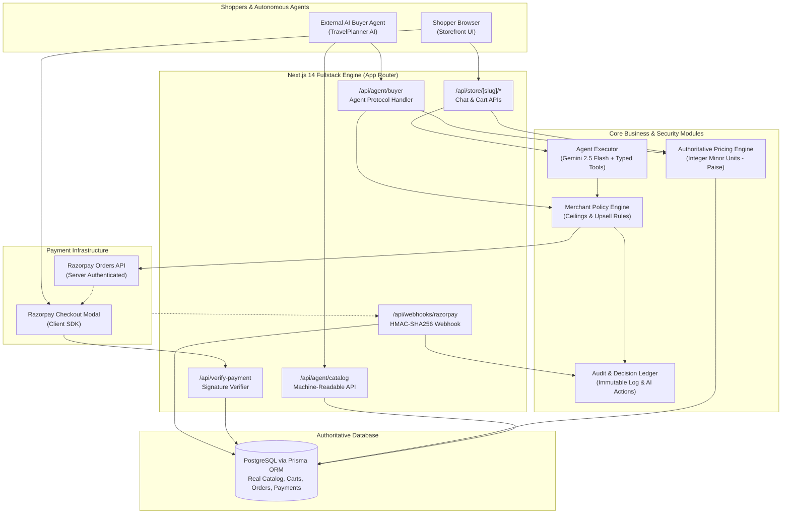

# SellFlow AI — Technical Architecture Specification

> **Track 01: AI Growth & Agentic Commerce**  
> *Architectural overview of the autonomous sales agent, server-authoritative policy engine, and Razorpay payment lifecycle.*

---

## 1. High-Level Architecture

SellFlow AI bridges conversational natural-language discovery, external autonomous AI buyers, and sovereign financial transaction safety. The architecture enforces strict boundaries between untrusted environments (the client browser and LLM text generation) and authoritative backend engines (pricing calculations, stock reservation, merchant risk policies, and Razorpay orders).



---

## 2. Dual Transaction Lifecycles

SellFlow AI supports two complementary transaction pathways:

### 2.1 The Customer Conversational Shopping Path
```text
Customer
   ↓
Next.js Application (/store/:merchantSlug)
   ↓
AI / Agent Layer (Gemini 2.5 Flash + 11 Typed Zod Tools)
   ↓
Policy Engine (Upsell Caps & Spending Thresholds)
   ↓
PostgreSQL / Prisma (Authoritative Stock & Minor-Unit Prices)
   ↓
Customer Explicit Confirmation
   ↓
Razorpay Order API (POST https://api.razorpay.com/v1/orders)
   ↓
Razorpay Checkout Modal (Standard Checkout)
   ↓
Payment Verification & HMAC-SHA256 Validation
   ↓
Asynchronous Webhook (Idempotent Deduplication)
   ↓
Immutable Audit Log & Merchant Console
```

### 2.2 The Autonomous AI Buyer Protocol Path
```text
External AI Buyer (e.g. TravelPlanner AI)
   ↓
Authenticated Agent API (GET /api/agent/catalog?merchant=apex-sports)
   ↓
Machine-Readable Catalog (Structured specs, availability, accessories)
   ↓
Autonomous Buyer Intent (POST /api/agent/buyer)
   ↓
Merchant Policy Engine (Ceilings, Upsell % checks, Confirmation gates)
   ↓
Server Price Calculation (Minor-unit subtotal + approved upsell)
   ↓
Customer Authorization Gate (If required by merchant policy)
   ↓
Razorpay Test Mode Order Generation
   ↓
Client-Side Checkout Authorization / Instant Settlement
   ↓
Asynchronous Webhook & Transaction Audit Trail
```

---

## 3. The Four Pillars of Agentic Financial Safety

| Pillar | Implementation in SellFlow AI | Architectural Guarantee |
|---|---|---|
| **Explainable** | Structured metadata attached to every recommendation, upsell proposal, and policy evaluation. | The merchant dashboard shows the exact plain-English rationale behind every item proposed and purchased. |
| **Bounded** | Hard ceilings configured in `MerchantPolicy`: maximum autonomous order amount (`maxAutonomousOrderAmount`) and maximum upsell percentage (`maxAutomaticUpsellPercentage`). | The LLM and client cannot exceed mathematically verified ceilings; orders above limits are blocked at the engine layer. |
| **Gated** | Mandatory customer confirmation flag (`requireCustomerConfirmation`) enforced before payment order creation. | Even when an autonomous AI buyer negotiates an order, funds cannot be transacted without explicit human authorization. |
| **Auditable** | Chronological records persisted in `AIAction` and `AuditLog` tables. | Every tool call, prompt input, policy decision, webhook receipt, and payment verification is permanently logged. |

---

## 4. Security & Sovereign Financial Authority

1. **Zero Client Price Trust**: Prices, taxes, line items, and totals submitted by the frontend or generated by the LLM are ignored. The backend recalculates totals directly against PostgreSQL records.
2. **Integer Minor Units**: All monetary values are strictly stored and computed as integer minor units (paise in INR, e.g., ₹3,499.00 = `349900`).
3. **Secret Isolation**: `RAZORPAY_KEY_SECRET`, `GEMINI_API_KEY`, `SESSION_SECRET`, and `RAZORPAY_WEBHOOK_SECRET` are strictly server-side environment variables and are never bundled into client-side code.
4. **Webhook Idempotency**: Inbound Razorpay webhooks calculate HMAC-SHA256 signatures using `RAZORPAY_WEBHOOK_SECRET`. Before updating order or payment status, events are deduplicated via unique `WebhookEvent` database entries.
5. **State Machine Integrity**: Orders cannot transition backwards (e.g., from `PAID` to `PENDING` or `FAILED`). Duplicate or delayed failure events cannot overwrite a verified payment.

---

## 5. PostgreSQL Entity Relationship Overview

- **`Merchant`**: Account profile, currency, credentials, relationships.
- **`MerchantPolicy`**: Risk ceilings, upsell ratios, gating toggles.
- **`Product`**: Verified inventory, prices in minor units, tags, use cases.
- **`ProductRelation`**: Verified catalog graph (accessories, complementary items).
- **`CustomerSession`**: Anonymous or authenticated shopper shopping state.
- **`Cart` & `CartItem`**: Authoritative server cart instances.
- **`Order` & `OrderItem`**: Bound financial contracts tied to Razorpay order IDs.
- **`Payment`**: Individual transaction attempts, capture states, methods.
- **`AIAction`**: Granular tool execution audit ledger.
- **`AuditLog`**: System security and state change log.
- **`WebhookEvent`**: Cryptographically verified webhook delivery ledger.
